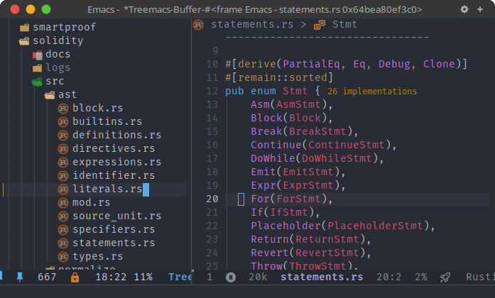

<div align="center">

# modern-icons-treemacs.el

Modern icons for Emacs [treemacs](https://github.com/Alexander-Miller/treemacs).

</div>

This library integrates [modern-icons.el](https://github.com/emacs-modern-icons/modern-icons.el) to display modern and pretty SVG icons for [treemacs](https://github.com/Alexander-Miller/treemacs) files and directories in Emacs.

## Installation

Install from Melpa (supported soon) or manually using [straight.el](https://github.com/radian-software/straight.el) like below:

```elisp
(use-package modern-icons
  :straight (modern-icons :type git :host github
                          :repo "emacs-modern-icons/modern-icons-treemacs.el"))
```

## Usage

Include the following code into your configuration file:

```elisp
(require 'modern-icons-treemacs)
(modern-icons-treemacs-enable)
```

## Screenshots

<p align="center">
  
</p>

## Acknowledgements

This library is inspired by [treemacs-nerd-icons](https://github.com/rainstormstudio/treemacs-nerd-icons).
